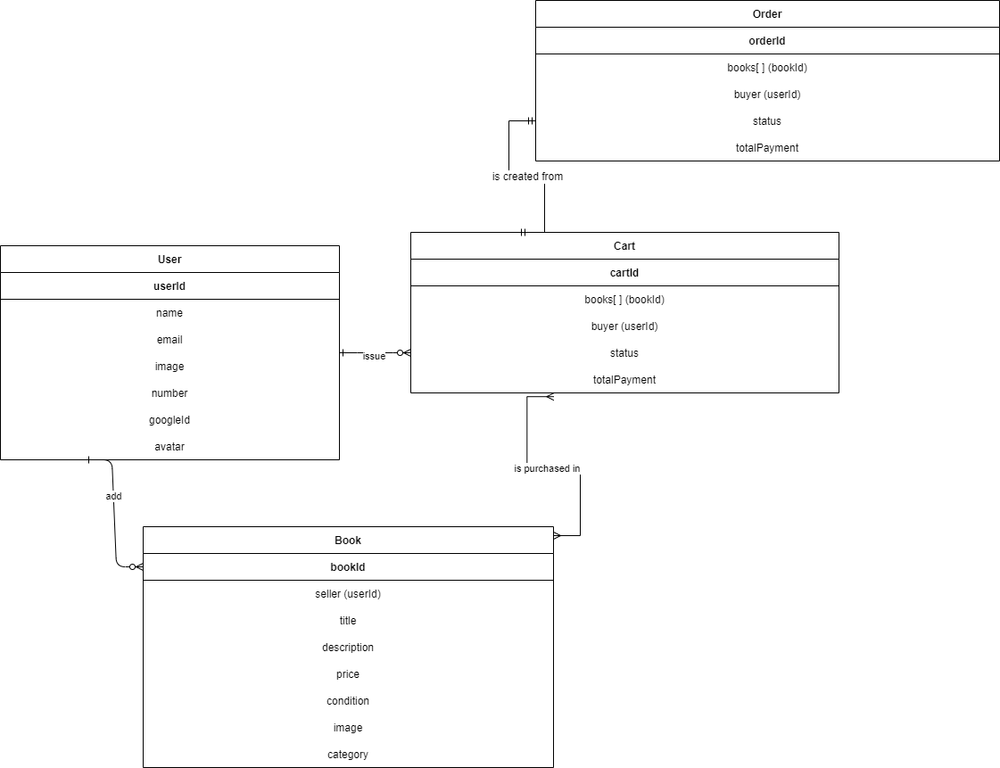
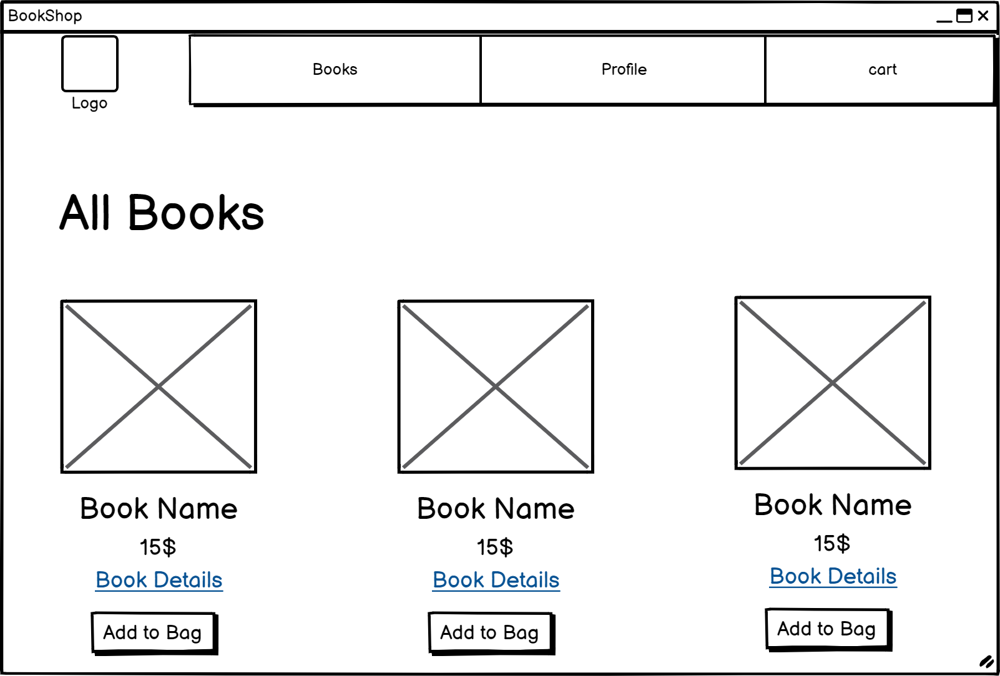
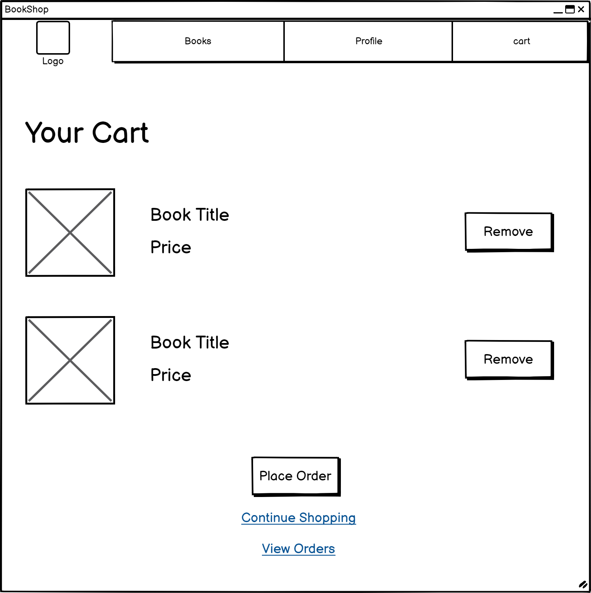
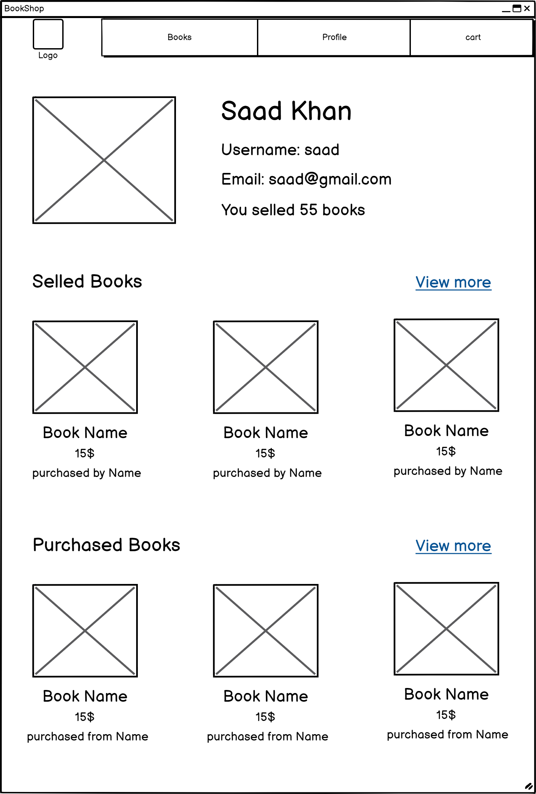

# **Secondhand Book Shop**

---

### _Developed By_

- Dana Khaled | [Linkedin](https://www.linkedin.com/in/dana-alebrahim-a22716267/) | [Github](https://github.com/DanaK270)

- Mohammad yaqoob | [Linkedin](www.linkedin.com/in/mohamed-yaqoob-abdulla) | [Github](https://github.com/MohamedYaqoob)

- Ali Yousif | [Linkedin](www.linkedin.com/in/ali-a-karim) | [Github](https://github.com/Aliiyousiff)

---

### _Project Overview_

#### This project is an online seconhand book shop, where users can add books for sale and purchase books from other users. Each user can create books, edit and delete book they have created, add books to cart, issue orders, and view their order history and the book they have put for sale. The website also have features for signup, signin and signout using google OAuth and it enables users to manage their profile.

---

### _ERD_

## 

### _Wireframes_

- Home Page

- View Books

- Cart

- Add Book

- Profile

---

### _Technologies Used_

- Node.js: Used as the backend for javaScript.

- Express.js: Provides the framework for handling routing, middleware, and building the RESTful API.

- MongoDB: The database used to store and manage data for users, books, carts, and orders.

- Mongoose: An ODM library used to define schemas and interact with MongoDB.

- EJS (Embedded JavaScript): Used for rendering our HTML pages while adding dynamic content.

- Passport.js: Handles user authentication for Signup, signin and sigout.

- Multer: Used to upload and store profile and book images.

- Bootstrap: A CSS framework used for improved and responsive design.

---

### _Unsolved Problems_

- When the seller deletes a book and other users already have it in their cart, the book is successfully removed from the cart, but the price of this book is not deducted from the cart's total payment.

- The order accesses books by reference, so when the seller updates the book's price, the new price will be displayed in the order not the old price that the buyer have payed.

- When the same book is added to cart more than once and then the buyer clicked "remove" for one of them only, all of them will get removed but the total payment of the cart will be deducted by the price of only one book.

---

### _Future Enhancements_

- We can adress the unsolved problems.

- Enable the user to create a wishlist to save books they want to buy.

- We can add rating and reviews for each book.

- We can add book quantiy and mark them as out of stock when the quantity reaches zero.

- Allow user to add multiple images for the book

- Add filers to search by the book category

- Add a search bar
